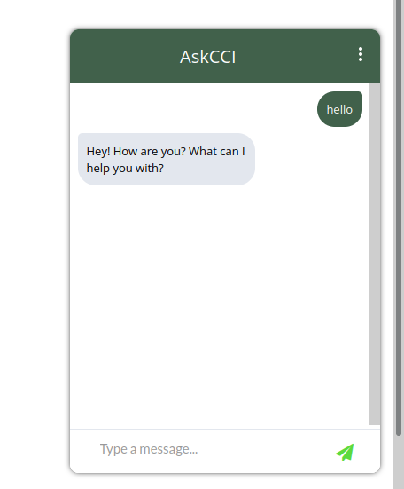
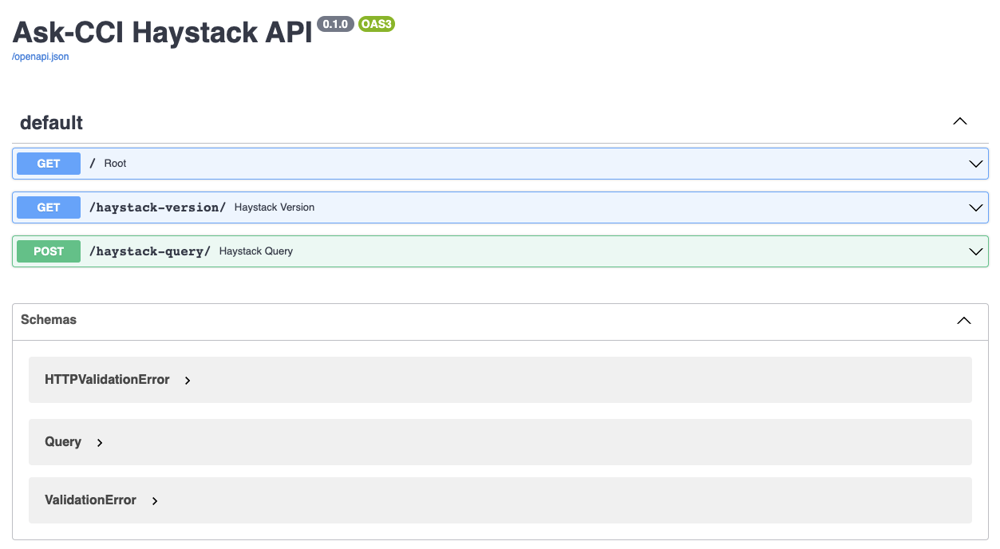

# Ask-CCI Bot

This repo contains the rasa bot project: **Ask-CCI Student Assist Bot** that was originally developed as part of the course ITIS-6112-8112 and has been further expanded for course DSBA-6345.

## Table of Contents

- [Project Setup](https://github.com/bhakthil/student-assist#project-setup)
- [Installaing Dependencies](https://github.com/bhakthil/student-assist#installing-dependencies)
- [How to Run The Chatbot](https://github.com/bhakthil/student-assist#how-to-run-the-chatbot)
- [How to Train the Chatbot](https://github.com/bhakthil/student-assist#how-to-train-the-chatbot)
  - [NLU](https://github.com/bhakthil/student-assist#datanluyml)
  - [Stories](https://github.com/bhakthil/student-assist#datastoriesyml)
  - [Domain](https://github.com/bhakthil/student-assist#datadomainyml)
- [How to Create a Trained Model](https://github.com/bhakthil/student-assist#how-to-create-a-trained-model)
- [Running Haystack Service](https://github.com/bhakthil/student-assist#running-haystack-service)
- [Running API Tests](https://github.com/bhakthil/student-assist#running-api-tests)

## Project Setup

1. Clone this project to your local system via:

    ```bash
    git clone https://github.com/bhakthil/student-assist.git
    ```

2. Change to the new directory:

    ```bash
    cd student-assist
    ```

3. Create a new virtual environment:

    ```bash
    python3 -m venv .venv
    ```

4. Activate the virtual environment

    ```bash
    source .venv/bin/activate
    ```

## Installing Dependencies

1. Update pip to the latest version

   ```bash
   pip install -U pip
   ```

2. Install `requirements.txt`:

    ```bash
    pip install -r requirements.txt
    ```

---

## How to Train The Chatbot

In order for the bot to understand different intents, it needs to be trained with sample utterances for each new intent.

There are few places that needs to be changed for a new intent to be added to the system.

## ./data/nlu.yml

Please add at least ten sample utterances for each of the intent you are responsible for. For an example, below markup is used to define `thank_you` intent.

  ```yml
  - intent: thank_you
    examples: |
    - Thanks
    - Thank You
    - thanks
    - thanks a lot
    - thank you so much
  ```

## ./data/stories.yml

Each intent should have at least 2 paths; **happy path** **and unhappy path**. So, please use below example to create paths for your intents.

```yml
- story: phd info happy path
  steps:
  - intent: phd_info
  - action: utter_phd_info
  - action: utter_did_that_help
  - intent: affirm
  - action: utter_happy
  - action: utter_continue

- story: phd info unhappy path
  steps:
  - intent: phd_info
  - action: utter_phd_info
  - action: utter_did_that_help
  - intent: deny
  - action: utter_helpdesk
  .
  .
  .
- story: **YOU_WILL_APPEND_YOUR_STORIES_HERE**
  steps:
  - intent: [new intent]
  - action: [new action]
  - action: ...
```

## ./domain.yml

Domain file is where you define the responses for each intent. You will add responses for each of your intent under `responses` section.

each response corrosponding to you utterance should be named in the format `utter_xxxx` where xxxx is the intent name that the respnse corrosponds to.

For example, the response corrosponding to `phd_info` intent is named as `utter_phd_info`.

```yml
responses:
  utter_phd_info:
  - text: "You can get more information about our PhD program at <a href='https://bit.ly/3whwJFL'>Link</a>"

  utter_msc_info:
  - text: "You can get more information about our MSc program at <a href='https://bit.ly/3GMPPIV'>Link</a>"
  .
  .
  .
  .
  utter_<YOUR_NEW_UTTERANCE >:
  - text: "YOUR NEW RESPONSE"

```

In addition, you will add your intent names under the `intents` section of the domain file.

```yml
intents:
  - greet
  - goodbye
  - affirm
  - deny
  - mood_great
  - mood_unhappy
  - bot_challenge
  - thank_you
###################
  - phd_info
  - msc_info
  - **YOU_WILL_APPEND_YOUR_INTENT(S)**
```

#### Training the Model

Once you finish adding the intents and the strories, you will be able to integrate the new additions/edits to your bot by re-training the bot.

Use below command to re-train the model:

```bash
rasa train
```
---
## How to Run The Chatbot


### One-line operation

1. To launch all services from one script, run the following:

    ```bash
    . ./run.sh
    ```

  To run each part of the system indiviually, use the following set(s) of instructions

### Starting separate services at a time

1. First, you must start the Rasa action server:
  
   ```bash
   rasa run actions
   ```

   - If the action server is running, you should be able to see the below message:

        ```bash
      (.venv) ➜  student-assist git:(dev) ✗ rasa run actions
      2022-03-09 14:41:23 INFO     rasa_sdk.endpoint  - Starting action endpoint server...
      2022-03-09 14:41:23 INFO     rasa_sdk.executor  - Registered function for 'action_info_retrieval'.
      2022-03-09 14:41:23 INFO     rasa_sdk.executor  - Registered function for 'action_default_ask_affirmation'.
      2022-03-09 14:41:23 INFO     rasa_sdk.endpoint  - Action endpoint is up and running on http://0.0.0.0:5055
      ```

2. In a separate terminal, you can start the chatbot server by executing:
  
    ```bash
    rasa run -m models --enable-api --cors "*"
    ```

   - If the server is up and running, you should be able to see the below message:

     ```bash
     (.venv) ➜  student-assist git:(dev) ✗ rasa run -m models --enable-api --cors "*"
     2022-03-09 14:34:53 INFO     root  - Starting Rasa server on http://0.0.0.0:5005
     2022-03-09 14:34:54 INFO     rasa.core.processor  - Loading model models/20220309-143217-broad-valid.tar.gz...
     2022-03-09 14:35:31 INFO     root  - Rasa server is up and running.
     ```

When you open the [AskCCI.html](https://github.com/bhakthil/student-assist/blob/main/Chatbot-Widget/AskCCI.html) file, you will notice chat icon in the bottom-right corner


You may start communicating with the bot by clicking on the on the bot icon.



### Running Haystack Service

1. Start the elasticsearch document store and initialize question-answer service (requires docker)

    ```bash
    python3 ./haystack/init_doc_store.py
    uvicorn app:app --reload --app-dir rest_api/
    ```

    This will create a new docker container called `elasticsearch` where all of the documents that can be queried will be stored. If this docker container ever stops you can either restart it from within docker dashboard or delete and recreate the container.

    This script also launches the REST API used for querying the Haystack service.

2. To access the Haystack API documentation, go to `http://127.0.0.1:8000/docs` in your browser. You should see the below image:

    

### Running API Tests

- To test that the API is functioning properly run the following:

    ```bash
    pytest api_tests/tests.py
    ```

---

[Back to Top](https://github.com/bhakthil/student-assist#ask-cci-bot)
